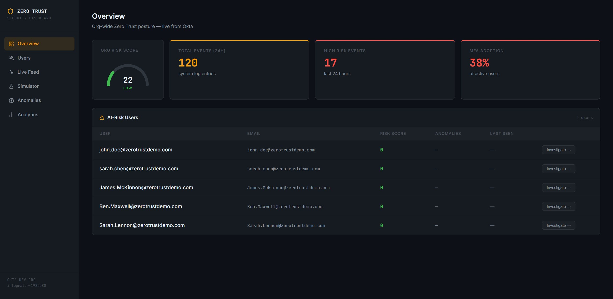
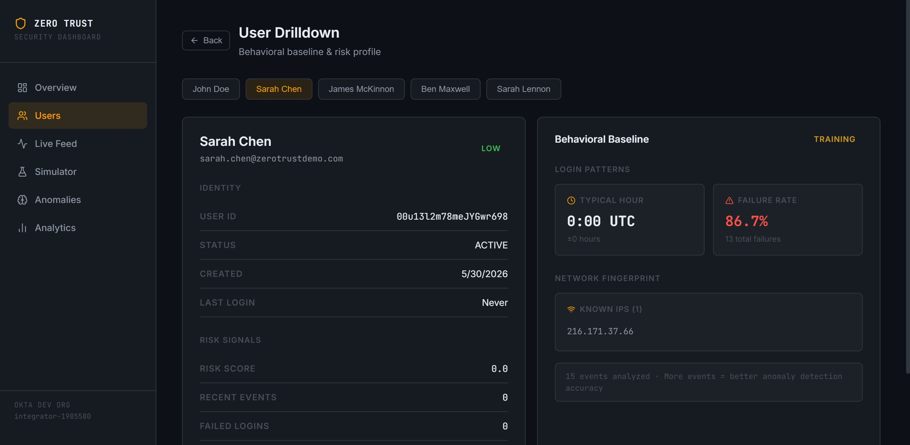
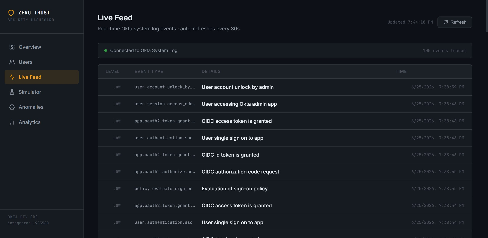
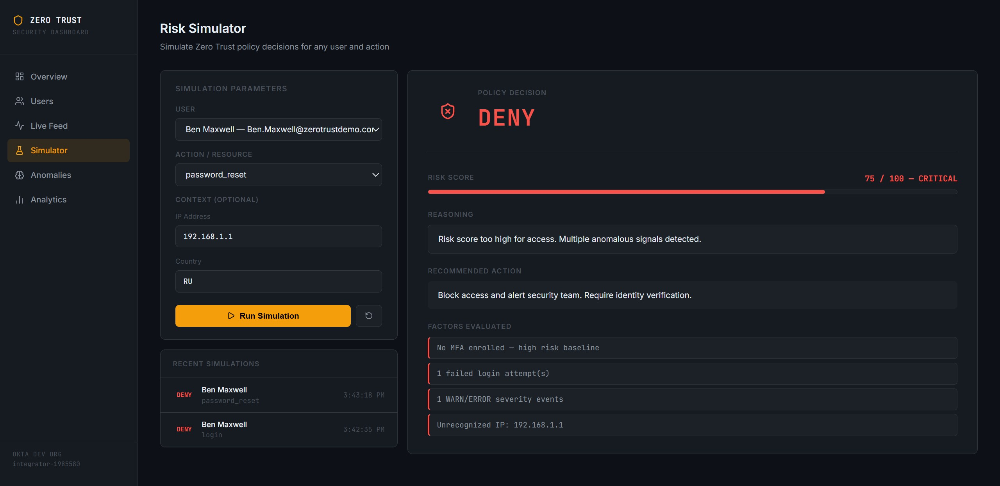
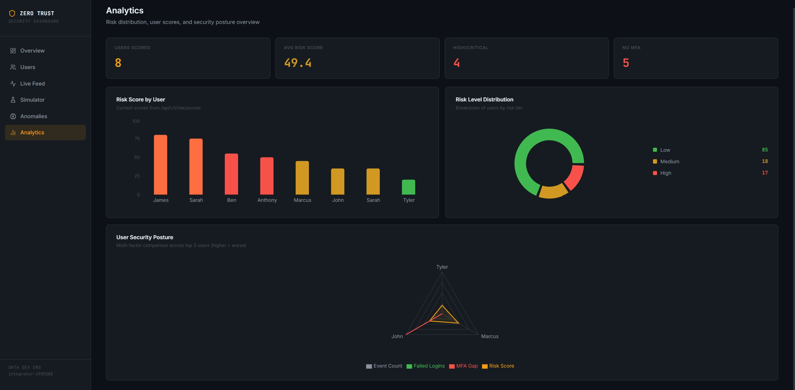

# Zero Trust Security Dashboard

A full-stack security operations dashboard built on Okta's identity platform, demonstrating Zero Trust architecture principles through real-time threat detection, behavioral analytics, and ML-powered anomaly detection.

**Live demo:** [zerotrust.tylersibley.dev](https://zerotrust.tylersibley.dev)  
**Live data from a real Okta org** — not mocked or simulated.

---



---

## What It Does

Traditional security models trust users by default once inside the network. Zero Trust assumes breach: every access request is verified continuously, not just at login.

This dashboard operationalizes that model by pulling identity telemetry from Okta's APIs, scoring user risk in real time, and surfacing anomalies using machine learning — the same architecture used in enterprise SIEM and UEBA tools.

---

## Features

### Overview
- Org-wide risk gauge derived from live event distribution
- 24-hour event volume and high-risk event count
- MFA adoption rate with compliance threshold alerting
- At-risk user table with one-click investigation

### User Drilldown


- Per-user behavioral baseline (typical login hour, known IPs, failure rate)
- Risk score and risk level from ML scoring engine
- MFA enrollment status and enrolled factors
- Identity metadata pulled directly from Okta Users API

### Live Feed


- Real-time Okta System Log event stream
- Severity classification by event type (HIGH / MED / LOW)
- Auto-refreshes every 30 seconds
- Color-coded by risk level

### Risk Simulator


- Simulate Zero Trust policy decisions for any user and action
- Pass optional context: IP address, country, resource
- Returns ALLOW / CHALLENGE / DENY with full reasoning
- Simulation history log

### Anomaly Detection


- Isolation Forest ML model trained on per-user behavioral baselines
- Score events against baseline — flags deviations in login hour, IP, failure rate
- Shows anomalous features and baseline comparison
- Re-trainable on demand

### Analytics


- Risk score bar chart across all users
- Risk level distribution donut chart
- Multi-factor security posture radar chart
- Live from `/api/v1/risk/scores`

---

## Architecture

```
┌─────────────────┐     ┌──────────────────────┐     ┌─────────────────┐
│   React Frontend │────▶│   FastAPI Backend     │────▶│   Okta APIs     │
│   (Vite/Vercel) │     │   (AWS Lambda)        │     │   System Log    │
│                 │     │                       │     │   Users API     │
│  - Overview     │     │  - Risk Scoring       │     │   Event Hooks   │
│  - Drilldown    │     │  - ML Anomaly Det.    │     └─────────────────┘
│  - Live Feed    │     │  - Policy Simulator   │
│  - Simulator    │     │                       │     ┌─────────────────┐
│  - Anomalies    │     │                       │────▶│   AWS DynamoDB  │
│  - Analytics    │     └──────────────────────┘     │   Event Storage │
└─────────────────┘                                   └─────────────────┘
```

**Backend:** Python / FastAPI / Mangum (AWS Lambda adapter)  
**ML:** scikit-learn Isolation Forest for unsupervised anomaly detection  
**Storage:** AWS DynamoDB for event persistence  
**Identity:** Okta System Log API, Users API, Event Hooks (real-time webhooks)  
**Frontend:** React / Vite / recharts / react-router-dom  
**Hosting:** Vercel (frontend) + AWS Lambda + API Gateway (backend)

---

## ML Anomaly Detection

The Isolation Forest model builds a behavioral baseline per user from historical Okta events:

- **Login hour distribution** — flags logins outside typical window
- **IP reputation** — surfaces new or unknown source IPs
- **Failure rate** — tracks authentication failure patterns over time
- **Event frequency** — detects spikes inconsistent with baseline behavior

Anomaly scores feed directly into the risk scoring engine, which classifies users as LOW / MEDIUM / HIGH / CRITICAL.

---

## API Endpoints

| Method | Endpoint | Description |
|--------|----------|-------------|
| GET | `/api/v1/events/summary` | 24h event counts, MFA adoption, risk distribution |
| GET | `/api/v1/events` | Paginated Okta system log events |
| GET | `/api/v1/users/at-risk` | Users with elevated risk scores |
| GET | `/api/v1/ml/baseline/{user_id}` | Behavioral baseline for a specific user |
| POST | `/api/v1/risk/simulate` | Simulate a Zero Trust policy decision |
| GET | `/api/v1/risk/scores` | Risk scores for all active users |

Full Swagger UI available at `/docs` when running locally.

---

## Running Locally

**Prerequisites:** Python 3.11, Node 18+, Okta Developer account, AWS account

```bash
# Backend
cd backend
python -m venv venv
. .\venv\Scripts\Activate.ps1  # Windows
pip install -r requirements.txt
cp .env.example .env           # Add your credentials
uvicorn app.main:app --reload --port 8000
```

```bash
# Frontend
cd frontend
npm install
npm run dev
```

Open `http://localhost:5173`

---

## Build Log

| Week | Deliverable |
|------|-------------|
| 1 | Okta API client, System Log ingestion, user profiles, MFA detection |
| 2 | FastAPI backend, 11 REST endpoints, risk scoring engine, Zero Trust policy simulator |
| 3 | DynamoDB event storage, Okta Event Hooks for real-time webhook ingestion |
| 4 | scikit-learn Isolation Forest ML model, per-user behavioral baselines |
| 5 | React frontend — Overview, User Drilldown, Live Feed — wired to live API |
| 6 | Risk Simulator UI, Anomaly Detection UI, GitHub + README |
| 7 | Analytics page with risk score charts and security posture visualization |
| 8 | Production deployment — AWS Lambda + API Gateway + Vercel + custom domain; resolved API Gateway CORS for cross-origin POST requests |


---

## About

Built by [Tyler Sibley](https://tylersibley.dev) — Customer Success Intern at Okta, IT student at Florida State University (graduating Spring 2027), Okta Certified Professional, AWS Cloud Practitioner.

This project was built during my Okta internship to develop hands-on depth in identity security and Zero Trust architecture — the technical foundation of modern enterprise security programs.
